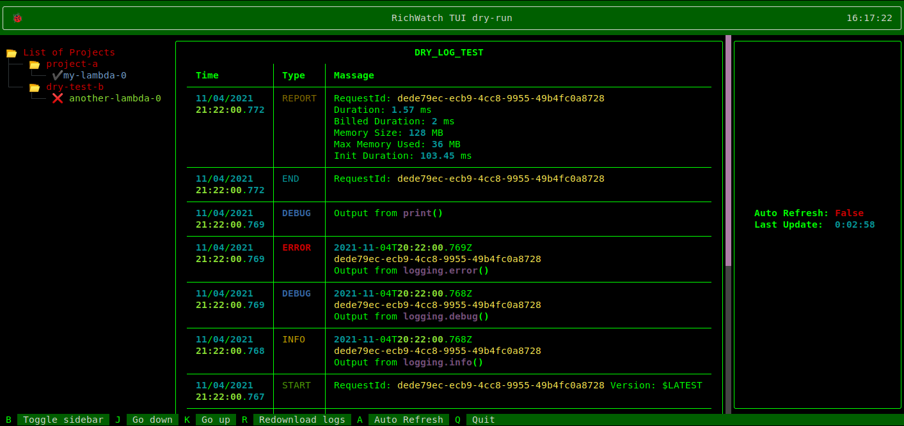

<p align="center">
<a href="https://github.com/Cvaniak/RichWatch"></a>
</p>  

<a href="https://www.python.org/"></a>
<a href="https://github.com/pfs/black"></a>
<a href="https://github.com/Cvaniak/RichWatch/blob/main/LICENSE"></a>

**RichWatch** is **TUI** (Textual User Interface) for **AWS Cloud Watch**.  
It formats and pretty prints **Cloud Watch**'s logs so they are much more readable.  
Because it works in terminal, you can have updates from your **Lambdas** and other **AWS** services next to your hand, automatically refreshed and represented in beautiful way by excelent **Python** library [**Rich**]("www.costam.com") and [**Textual**]("www.costam.com"),

## **Content**
- [What is the difference❓](#what-is-the-difference)
- [Setup and Usage ⚙️](#setup-and-usage-️)
    - [**AWS credentials for Boto3**](#aws-credentials-for-boto3)
    - [**Install requirements**](#install-requirements)
    - [**Setup Log Group file**](#setup-log-group-file)
    - [**Run App**](#run-app)
- [TODO 📝](#todo-)

# What is the difference❓
So this is example Log output from **AWS Cloud Watch**:  
    
And here is same output but using **RichWatch**: 

  > ⚠️ There is no theme setup yet so **Rich** format is based of your terminal Theme. Setup for this screenshot is `zsh` with `agnoster` in `Tilda` console.  

And both are for same **Lambda** code:
```python
import json
import logging

logger = logging.getLogger()
logger.setLevel(logging.DEBUG)

def lambda_handler(event, context):
    logger.info("Output from logging.info()")
    logger.debug("Output from logging.debug()")
    logger.error("Output from logging.error()")
    print("Output from print()")
    return {
        'statusCode': 200,
        'body': json.dumps('This is from response!')
    }
```
# Setup and Usage ⚙️
### **AWS credentials for Boto3**
To start you need to setup credentials for **AWS**. You can do this using **AWS Command Line**, in `~/.aws/credentials` file or via `export` command of environment variables. You can read more about this [here](https://boto3.amazonaws.com/v1/documentation/api/latest/guide/configuration.html).
### **Install requirements**
You need `Python` and `pip` in version `3.6` or higher.  
Then you need to install requirements:
```bash
pip3 install -r requirements.txt
```
### **Setup Log Group file**
Then you need to create `log_group.txt` file like this:
```txt
/aws/lambda/lambda-name-1 region-name-1
/aws/lambda/lambda-name-2 
...
/aws/lambda/lambda-name-n region-name-n
```
Where first word is name o log group, and second optional region(if empty then the default will be taken, if also empty then error will occur). It will display only last part after `/`.
### **Run App**
Then you can run app:
```bash
python3 rich_watch.py
```
or get logs once and printout to stdout with:
```bash
python3 main.py <log_group>
```


# TODO 📝
⭕ Set default style  
⭕ Allow for custom style  
⭕ Support AWS CLI profiles  
⭕ Save logs to file  
⭕ Check for updates and only download the latest  
⭕ Create RichCloud a PyPi package  
⭕ Custom log TAGs highlight  
⭕ Custom refresh time  
⭕ Collapse all ENDs, STARTs and REPORTs, ect.  
⭕ Better TreeView  
⭕ Better StatusView  
⭕ Dry run (demo without AWS account)

> ⚠️ The TUI version of RichWatch is base on **Textual** witch is in progress. If you see any bugs please let me know. Currently TUI is only working for *Linux* and *Macs* but on *Windows* you can run this in script version.